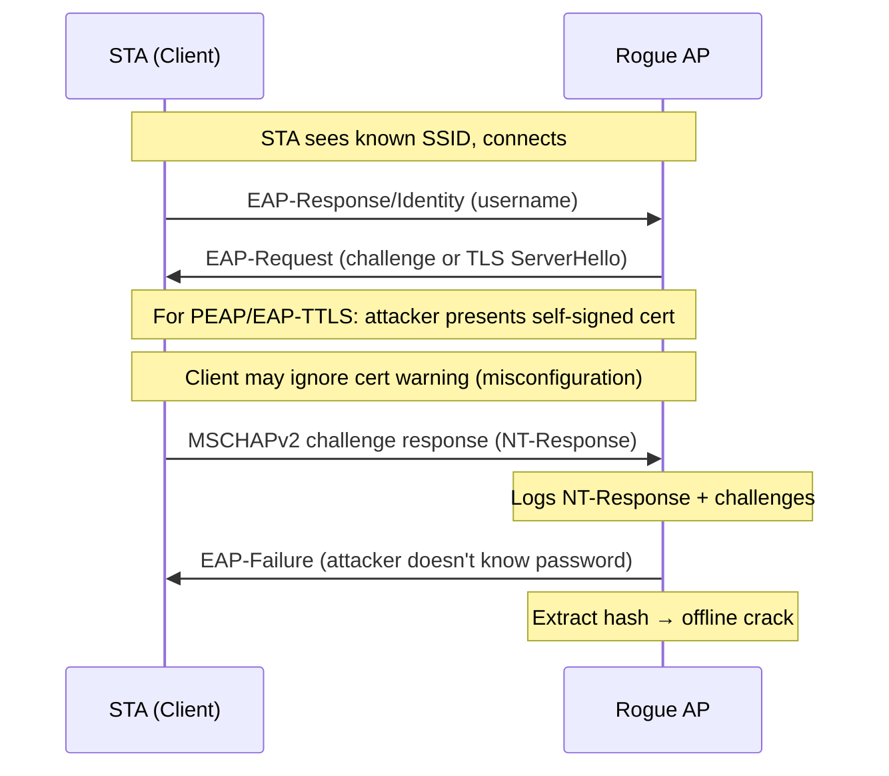

# EAP Attacks

EAP (Extensible Authentication Protocol) attacks target enterprise wireless
networks using 802.1X authentication. Unlike PSK networks, EAP networks
authenticate individual users against a RADIUS server. Crackable output
requires capturing the inner authentication exchange.

## Rogue AP Concept

A rogue AP (evil twin) impersonates a legitimate enterprise network by
broadcasting the same SSID. When a client connects and initiates EAP
authentication, the rogue AP captures the credential exchange.

For PEAP/EAP-TTLS: clients must validate the server certificate. Misconfigured
clients that accept any certificate are the primary target. Correctly configured
clients will fail at the certificate validation step and not expose credentials.

For LEAP and EAP-MD5: no TLS tunnel — credentials are captured by passive
sniffing or MitM.

## EAP Type Taxonomy

### Commonly Deployed (attack-relevant)

| EAP type | Code | Inner method | Crackable? | hashcat mode | Capture method |
|----------|------|-------------|-----------|-------------|----------------|
| PEAP | 25 | MSCHAPv2 | Yes (if cert ignored) | 5500 | Rogue AP |
| EAP-TTLS | 21 | MSCHAPv2 | Yes (if cert ignored) | 5500 | Rogue AP |
| EAP-TTLS | 21 | PAP | No hash | N/A | Rogue AP (plaintext) |
| EAP-MD5 | 4 | MD5-Challenge | Yes | 4800 | Passive capture |
| LEAP | 17 | MS-CHAPv1 | Yes | 5500 | Passive capture |
| EAP-TLS | 13 | Certificate | No | N/A | No password |
| EAP-FAST | 43 | MSCHAPv2 | Conditional | 5500 | PAC provisioning attack |

### Other Registered Types

??? note "Other IANA-registered EAP types"
    Types rarely encountered in wireless deployments:

    | Code | Name | Notes |
    |------|------|-------|
    | 6 | GTC | Generic Token Card; rarely used without OTP hardware |
    | 32 | POTP | Protected OTP; niche |
    | 38 | EAP-TLV | Container type, not an auth method |
    | 50 | EAP-AKA | Cellular SIM-based; common in carrier WiFi |
    | 52 | EAP-SIM | Older SIM-based; carrier WiFi |
    | 55 | EAP-AKA' | Updated AKA |
    | 56 | EAP-NOOB | Nimble OOB; IoT enrollment |

## Which Methods Produce Crackable Output

Only methods that transmit a password-derived challenge/response (either in
cleartext or inside a TLS tunnel that the attacker controls) yield crackable
material:

| Method | Why crackable | hashcat mode |
|--------|--------------|-------------|
| MSCHAPv2 (in PEAP/EAP-TTLS) | NT hash challenge/response captured from TLS tunnel | 5500 |
| EAP-MD5 | MD5(ID \|\| password \|\| challenge) transmitted in cleartext | 4800 |
| LEAP (MS-CHAPv1) | DES-based response transmitted in cleartext | 5500 |

EAP-TLS exposes only certificates — no shared secret or password hash is transmitted.
An attacker can observe that authentication succeeded but gains nothing crackable.

## Tool Chain

| Step | Tool | Output |
|------|------|--------|
| Capture (PEAP/EAP-TTLS) | hostapd-mana (rogue AP) | `mschapv2.hashes` |
| Capture (EAP-MD5, LEAP) | hcxpcapngtool `--eapmd5` / `--eapleap` | hash files |
| Crack MSCHAPv2 / LEAP | hashcat -m 5500 | NT hash or plaintext |
| Crack EAP-MD5 | hashcat -m 4800 | plaintext password |
