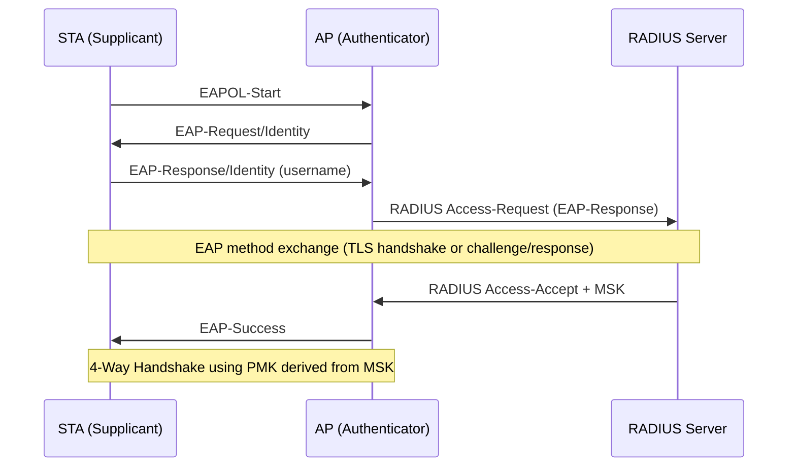

# Enterprise Family (AKM 1, 3, 5, 11-13, 22, 23)

Enterprise AKMs use the IEEE 802.1X framework to authenticate stations through
an EAP exchange with a backend RADIUS server. The PMK is derived from the EAP
Master Session Key, not from a passphrase.

## Overview

In Enterprise mode, the AP acts as an authenticator that relays EAP frames
between the supplicant (STA) and the authentication server (RADIUS). The EAP
method (EAP-TLS, PEAP, EAP-TTLS, LEAP, etc.) determines the actual
authentication mechanism. Upon success, both RADIUS and STA derive a Master
Session Key (MSK), from which the PMK is extracted.

## EAP Authentication Flow



## PMK Derivation from MSK

After a successful EAP exchange, the RADIUS server sends the MSK to the AP
via RADIUS Access-Accept (MPPE keys attribute). Both the STA and the server
independently derive the same MSK from the EAP exchange.

```
PMK = MSK[0:32]     -- for AKM 1, 3, 5, 11 (SHA-256 suites)
PMK = MSK[0:48]     -- for AKM 12, 13, 22, 23 (SHA-384 suites, 384-bit PMK)
```

The MSK is typically 512 bits (64 bytes). Only the first 256 or 384 bits are
used as the PMK, depending on the AKM suite. The rest of the MSK may be used
as an Extended Master Session Key (EMSK) for other purposes.

After PMK derivation, the 4-way handshake proceeds identically to PSK mode
using the PMK derived from the EAP exchange.

## AKM Groupings

### SHA-1 — AKM 1

Original 802.1X AKM from 802.11i-2004. Uses HMAC-SHA1-based PRF for PTK
derivation (same PRF as AKM 2). MIC uses HMAC-MD5 (kv1) or HMAC-SHA1-128 (kv2)
depending on the cipher suite.

### FT-802.1X — AKM 3

Adds Fast Transition to AKM 1, enabling fast roaming in enterprise deployments.
Uses the FT key hierarchy (PMK-R0 / PMK-R1) with KDF-SHA-256. The R0 key
holder role is filled by the RADIUS server or a dedicated FT infrastructure
component (R0KH).

### SHA-256 — AKM 5

SHA-256 upgrade of AKM 1 from 802.11w-2009 (Management Frame Protection).
KDF-SHA-256 for PTK derivation. MIC uses AES-128-CMAC (keyver 3).

### Suite B (SHA-256) — AKM 11

AKM 11 targets the 128-bit security level. Same KDF-SHA-256 as AKM 5. Mandates
Suite B cipher suites: AES-128-CCM or AES-128-GCM for data frames.

### Suite B (SHA-384) — AKM 12, 13

AKM 12 targets the 192-bit security level with SHA-384-based KDF. Key sizes:
KCK = 192 bits, KEK = 256 bits, TK = 256 bits. MIC uses HMAC-SHA-384
(truncated to 192 bits / 24 octets, keyver 0 = AKM-defined).

Mandates AES-256-GCM or AES-256-CCM cipher suites. AKM 13 adds FT to AKM 12.

### 802.11-2024 Extensions — AKM 22, 23

AKM 22 is a SHA-384 enterprise AKM equivalent to AKM 12 but defined under the
802.11-2024 revision. AKM 23 adds FT. These were introduced to align with
CNSA 2.0 requirements.

## Suite B Compliance

Suite B (now CNSA — Commercial National Security Algorithm Suite) defines
minimum cryptographic requirements for government and high-security networks:

| Suite | Security level | AKMs | Cipher | PRF/KDF |
|-------|---------------|------|--------|---------|
| Suite B-128 | 128-bit | 11 | AES-128-CCM/GCM | SHA-256 |
| Suite B-192 (CNSA) | 192-bit | 12, 13, 22, 23 | AES-256-GCM | SHA-384 |

CNSA-compliant deployments require AKM 12/13 or 22/23 with GCMP-256 cipher
suite and P-384 or RSA-3072+ certificates for EAP-TLS.

## EAP Method Selection

The choice of EAP inner method determines whether credentials are crackable:

| EAP method | Transport | Inner auth | Offline crackable? | hashcat mode |
|------------|-----------|------------|-------------------|-------------|
| EAP-TLS | TLS 1.2+ | Certificates | No | N/A |
| PEAP/MSCHAPv2 | TLS tunnel | NTHash challenge | Yes (rogue AP needed) | 5500 |
| EAP-TTLS/PAP | TLS tunnel | Plaintext password | No hash to crack | N/A |
| EAP-TTLS/MSCHAPv2 | TLS tunnel | NTHash challenge | Yes (rogue AP needed) | 5500 |
| EAP-FAST | TLS tunnel | Varies | Method-dependent | — |
| LEAP | None (cleartext) | MS-CHAPv1 | Yes (passive capture) | 5500 |
| EAP-MD5 | None (cleartext) | MD5-Challenge | Yes (passive capture) | 4800 |

The WPA handshake (4-way) itself is not crackable for Enterprise AKMs — the
PMK is derived from the MSK, not from a password exposed in the frame exchange.
Attacks target the EAP inner method credentials, not the 802.11 key derivation.

## Spec References

- 802.1X framework: IEEE 802.1X-2020
- Enterprise PMK derivation: 802.11-2024 §12.7.1.3
- EAP base protocol: RFC 3748
- PEAP: draft-josefsson-pppext-eap-tls-eap (PEAPv0/v1)
- MSCHAPv2: RFC 2759
- AKM selectors: Table 9-190
- Key sizes: Table 12-8
