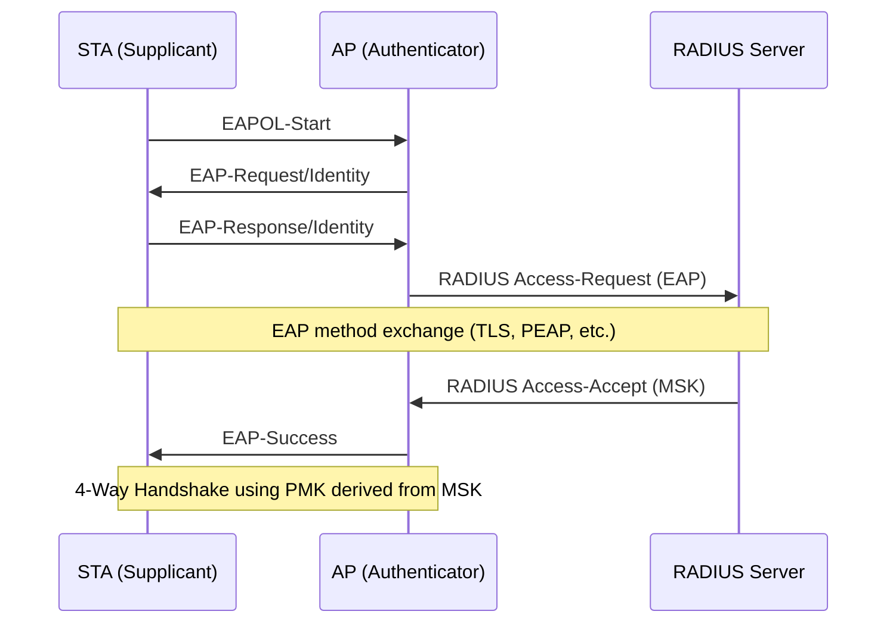

# Enterprise Family (AKM 1, 3, 5, 11-13, 22, 23)

Enterprise AKMs use the IEEE 802.1X framework to authenticate stations through an EAP exchange with a backend RADIUS server. The PMK is derived from the EAP Master Session Key, not from a passphrase.

## Overview

In Enterprise mode, the AP acts as an authenticator that relays EAP frames between the supplicant (STA) and the authentication server (RADIUS). The EAP method (EAP-TLS, PEAP, EAP-TTLS, etc.) determines the actual authentication mechanism. Upon success, the RADIUS server and STA both derive an MSK, from which the PMK is extracted.

## EAP Authentication Flow

## PMK Derivation from MSK

<!-- TODO: document MSK → PMK extraction (first 256 or 384 bits depending on AKM) -->

The PMK is the first N bits of the Master Session Key produced by the EAP method. For SHA-1 and SHA-256 AKMs, N = 256. For SHA-384 AKMs (12, 13, 22, 23), N = 384. The MSK itself is typically 512 bits.

## AKM Groupings

### SHA-1 -- AKM 1

The original 802.1X AKM from 802.11i-2004. Uses HMAC-SHA1-based PRF for PTK derivation and HMAC-MD5 or HMAC-SHA1 for the MIC depending on the key descriptor version.

### FT-802.1X -- AKM 3

Adds Fast Transition support to AKM 1, enabling fast roaming in enterprise deployments. Uses the FT key hierarchy (PMK-R0 / PMK-R1) with SHA-256-based KDF.

### SHA-256 -- AKM 5, 11

AKM 5 is the SHA-256 upgrade of AKM 1 from 802.11w-2009. AKM 11 adds Suite B compliance with SHA-256-based KDF and AES-128-CMAC for the MIC.

### SHA-384 -- AKM 12, 13, 22, 23

AKM 12 provides Suite B at the 192-bit security level with SHA-384-based KDF. AKM 13 adds FT to AKM 12. AKMs 22 and 23 are the 802.11-2024 extensions for SHA-384 enterprise and FT-enterprise respectively.

## Suite B Compliance

<!-- TODO: document CNSA/Suite B cipher requirements and which AKMs satisfy them -->

Suite B (now CNSA) defines minimum cryptographic strength requirements for government networks. AKMs 11-13 were designed to meet these requirements: AKM 11 at the 128-bit security level (SHA-256, AES-128) and AKMs 12-13 at the 192-bit security level (SHA-384, AES-256/GCMP-256).

## Spec References

- 802.1X key management: 802.11-2024 Section 12.7.1.3
- PTK derivation variants: Section 12.7.1.6
- AKM selectors: Table 9-190
