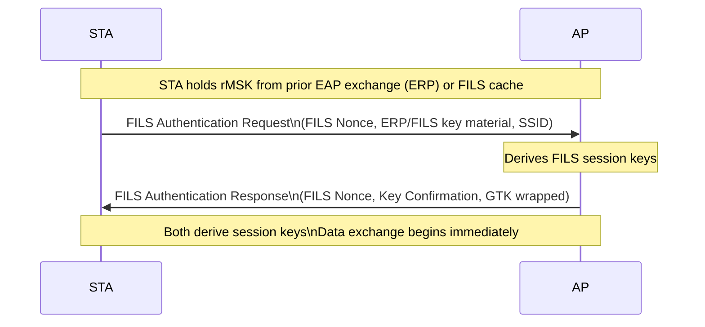

# FILS Family (AKM 14-17)

Fast Initial Link Setup (FILS) reduces association latency by combining
authentication, key establishment, and association into fewer frame exchanges.
Targets high-density environments (stadiums, transit) with frequent
re-associations.

## Overview

Standard 802.1X requires multiple round trips (EAP exchange → 4-way handshake)
before data can flow. FILS reduces this to two frames — Authentication Request
and Authentication Response — by incorporating key confirmation directly into
the association frames. Sub-100ms connections are achievable.

## FILS Authentication Flow



FILS authentication is based on EAP Re-authentication Protocol (ERP, RFC 6696).
The station uses a re-authentication Root Key (rRK) derived during an initial
full EAP exchange to produce a re-authentication MSK (rMSK) for subsequent
fast connections, without going back to the RADIUS server.

## Key Derivation

FILS derives a session key from the rMSK:

```
FILS-Key-Data = KDF-Hash(rMSK || ANonce || SNonce,
                         "FILS PTK Derivation",
                         MAC_AP || MAC_STA)
```

The output is split into ICK (Integrity Check Key), KEK, and TK. The ICK
replaces the KCK for MIC computation in FILS-specific frames.

Key sizes:

| AKM | Hash | ICK | KEK | TK |
|-----|------|-----|-----|-----|
| 14, 16 | SHA-256 | 256 bits | 256 bits | cipher-dependent |
| 15, 17 | SHA-384 | 384 bits | 512 bits | cipher-dependent |

## AKM Variants

| AKM | Name | Hash | FT? | Standard |
|-----|------|------|-----|----------|
| 14 | FILS-SHA256 | SHA-256 | No | 802.11ai-2016 |
| 15 | FILS-SHA384 | SHA-384 | No | 802.11ai-2016 |
| 16 | FT-FILS-SHA256 | SHA-256 | Yes | 802.11ai-2016 |
| 17 | FT-FILS-SHA384 | SHA-384 | Yes | 802.11ai-2016 |

AKMs 16 and 17 combine FILS with Fast Transition, enabling both fast initial
connection and fast roaming within the same mobility domain.

## Security Posture

FILS does not change the authentication security model — credentials are still
EAP-method-dependent. FILS only affects the protocol efficiency. The MIC in
FILS frames uses the ICK (not the KCK from the 4-way handshake), but this
does not create new offline attack vectors beyond the EAP inner method.

AKMs 14/15/16/17 have no offline attack paths against the 802.11 key material.

## Spec References

- FILS protocol: 802.11-2024 §12.11
- FILS key derivation: §12.11.2
- EAP Re-authentication Protocol: RFC 6696
- AKM selectors: Table 9-190
