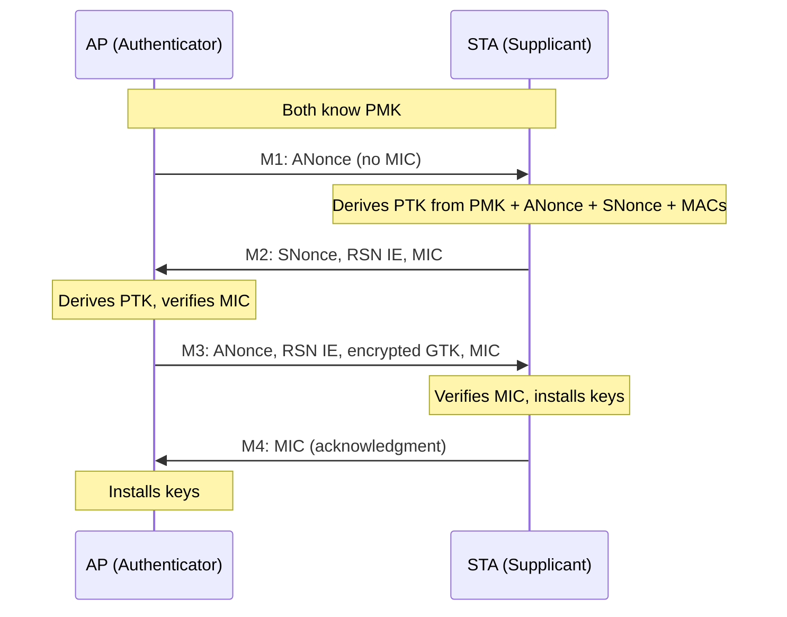

# 4-Way Handshake

The 4-way handshake is the mechanism by which an AP and STA mutually prove possession of the PMK and install session keys, without ever transmitting the PMK itself.

## Overview

After authentication (open system, SAE, or 802.1X), both sides hold the same PMK. The 4-way handshake exchanges nonces, derives the PTK, and distributes the GTK -- all authenticated by MICs computed with the KCK portion of the PTK.

## Message Flow

## Message Details

| Message | Sender | Contains | MIC? | What It Proves |
|---------|--------|----------|------|----------------|
| M1 | AP | ANonce, optionally PMKID in Key Data | No | Nothing (unauthenticated) |
| M2 | STA | SNonce, STA's RSN IE | Yes | STA knows the PMK |
| M3 | AP | ANonce, AP's RSN IE, encrypted GTK | Yes | AP knows the PMK |
| M4 | STA | Acknowledgment | Yes | Handshake complete |

## Key Information Bitfield

<!-- TODO: document the 16-bit Key Information field from the EAPOL-Key frame header -->
<!-- Bits: Key Descriptor Version (0-2), Key Type (3), Key Index (4-5), Install (6), Key Ack (7), Key MIC (8), Secure (9), Error (10), Request (11), Encrypted Key Data (12), SMK Message (13) -->

The Key Information field in each EAPOL-Key frame encodes which message type is being sent, whether a MIC is present, whether the key data is encrypted, and the key descriptor version that determines MIC and key-wrap algorithms. Full bitfield documentation will be added here.

## Spec References

- 4-way handshake procedure: 802.11-2024 Section 12.7.6
- EAPOL-Key frame format: Section 12.7.2
- Key Information field: Section 12.7.3, Figure 12-47
