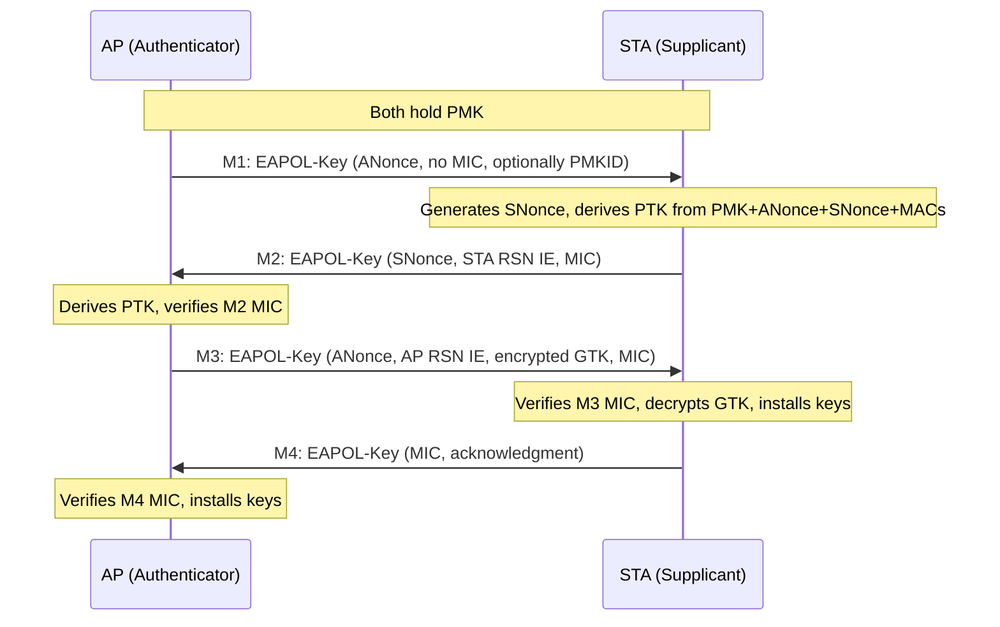

# 4-Way Handshake

The 4-way handshake is the mechanism by which an AP and STA mutually prove
possession of the PMK and install session keys, without ever transmitting
the PMK itself. Defined in IEEE 802.11-2024 §12.7.6.

## Overview

After authentication (open system, SAE, or 802.1X), both sides hold the same
PMK. The 4-way handshake exchanges nonces, derives the PTK, and distributes
the GTK — all authenticated by MICs computed with the KCK portion of the PTK.

## Message Flow

## Message Details

| Message | Direction | Nonce field | MIC? | Key Data |
|---------|-----------|-------------|------|----------|
| M1 | AP → STA | ANonce | No | PMKID (optional) |
| M2 | STA → AP | SNonce | Yes | STA's RSN IE |
| M3 | AP → STA | ANonce | Yes | Encrypted GTK + AP RSN IE |
| M4 | STA → AP | 0 (should be zeroed per §12.7.6.5) | Yes | Empty |

!!! note "M4 nonce value"
    IEEE 802.11-2024 §12.7.6.5 says M4's Key Nonce "should" be set to 0
    (changed from "shall" in 802.11i-2004). NOTE 9 documents that some
    implementations copy the SNonce from M2 instead. M4 is unusable as an
    EAPOL source for cracking when the nonce field is zeroed, because hashcat
    cannot reconstruct both nonces.

## Key Information Bitfield

The 2-byte Key Information field in every EAPOL-Key frame encodes the message
type, descriptor version, and processing flags.

| Bits | Field | M1 | M2 | M3 | M4 |
|------|-------|----|----|----|----|
| 0–2 | Key Descriptor Version | 1–3 | same as M1 | same as M1 | same as M1 |
| 3 | Key Type | 1 (Pairwise) | 1 | 1 | 1 |
| 4–5 | Reserved | 0 | 0 | 0 | 0 |
| 6 | Install | 0 | 0 | 1 | 0 |
| 7 | Key ACK | 1 | 0 | 1 | 0 |
| 8 | Key MIC | 0 | 1 | 1 | 1 |
| 9 | Secure | 0 | 0 | 1 | 1 |
| 10 | Error | 0 | 0 | 0 | 0 |
| 11 | Request | 0 | 0 | 0 | 0 |
| 12 | Encrypted Key Data | 0 | 0 | 1 | 0 |
| 13–15 | Reserved | 0 | 0 | 0 | 0 |

**Key Descriptor Version** determines the MIC algorithm and key-wrap cipher:

| Version | Used with | MIC | Key wrap |
|---------|-----------|-----|----------|
| 1 | TKIP cipher | HMAC-MD5 | RC4 |
| 2 | CCMP cipher (AKM 2) | HMAC-SHA1-128 | AES-128 NIST key wrap |
| 3 | AKM 3, 4, 5, 6 | AES-128-CMAC | AES-128 NIST key wrap |

## Message Identification Summary

hcxpcapngtool and hashcat use Key Information flags and nonce presence to
identify which message is which:

| Message | Key ACK | Key MIC | Install | Secure | Nonce |
|---------|---------|---------|---------|--------|-------|
| M1 | 1 | 0 | 0 | 0 | ANonce |
| M2 | 0 | 1 | 0 | 0 | SNonce |
| M3 | 1 | 1 | 1 | 1 | ANonce |
| M4 | 0 | 1 | 0 | 1 | 0 (usually) |

## Spec References

- 4-way handshake procedure: 802.11-2024 §12.7.6
- M1–M4 frame construction: §12.7.6.2–12.7.6.5
- EAPOL-Key frame format: §12.7.2
- Key Information field: §12.7.3, Figure 12-36
