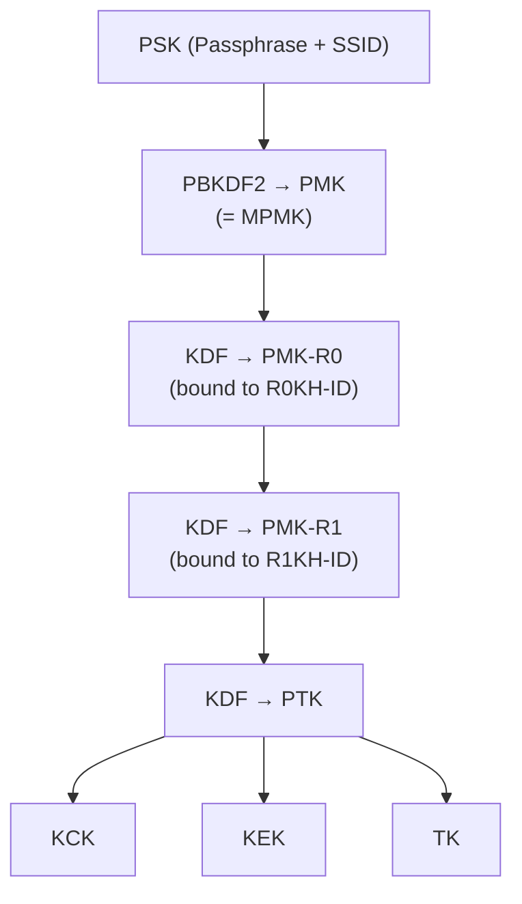

# FT-PSK Family (AKM 4, 19)

Fast Transition (802.11r) allows stations to pre-authenticate with a target AP before roaming, reducing handoff latency. AKM 4 and 19 apply FT to PSK networks, using a three-level key hierarchy instead of the standard two-level one.

## Overview

FT-PSK networks still derive the initial PMK from a passphrase via PBKDF2, so captured FT handshakes are offline-crackable. The difference is in what happens after PMK derivation: FT introduces PMK-R0 and PMK-R1 intermediate keys, and the PTK derivation uses different inputs than the standard 4-way handshake.

## FT Key Hierarchy

## PMK-R0 Derivation

<!-- TODO: document KDF inputs: PMK, SSID, MDID, R0KH-ID, S0KH-ID -->

PMK-R0 is derived from the PMK (called MPMK in FT terminology) using a KDF that binds the key to the mobility domain (MDID) and the R0 key holder identity (R0KH-ID). This ensures the key is domain-specific.

## PMK-R1 Derivation

<!-- TODO: document KDF inputs: PMK-R0, R1KH-ID, S1KH-ID -->

PMK-R1 is derived from PMK-R0 and bound to the specific target AP (R1KH-ID). The R0 key holder pushes PMK-R1 to the target AP before the station roams, enabling fast reassociation.

## PTK Derivation

<!-- TODO: document FT-specific PTK derivation inputs: PMK-R1, SNonce, ANonce, BSSID, STA-Addr -->

The FT PTK derivation uses the same KDF as the corresponding non-FT AKM but takes PMK-R1 (not PMK) as input along with the standard nonces and MAC addresses.

## MDE and FTE Information Elements

<!-- TODO: document Mobility Domain Element and Fast Transition Element fields -->

The MDE (Mobility Domain Element) advertises FT capability and contains the MDID and FT policy flags. The FTE (Fast Transition Element) carries the MIC, ANonce, SNonce, and key holder identities used during FT authentication.

## AKM 4 vs AKM 19

| Property | AKM 4 | AKM 19 |
|----------|-------|--------|
| Standard | 802.11r-2008 | 802.11-2020 |
| KDF Hash | SHA-256 | SHA-384 |
| KCK Size | 128 bits | 192 bits |
| KEK Size | 128 bits | 256 bits |
| TK Size | 128 bits | 256 bits |
| Typical Cipher | CCMP-128 | GCMP-256 |

## Spec References

- FT key hierarchy: 802.11-2024 Section 12.7.1.6
- FT protocol: Section 13.6
- AKM selectors: Table 9-190
