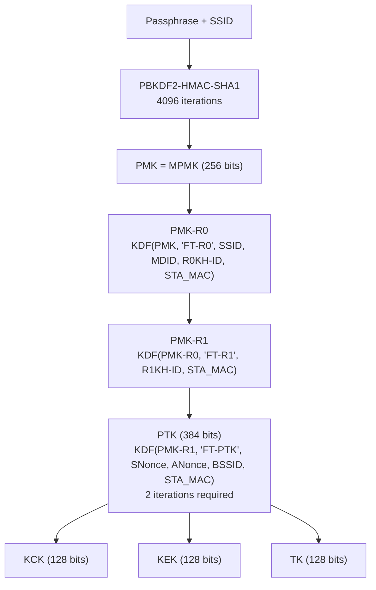

# FT-PSK Family (AKM 4, 19)

Fast Transition (802.11r) allows stations to pre-authenticate with target APs
before roaming, reducing handoff latency. AKM 4 and 19 apply FT to PSK
networks, using a three-level key hierarchy.

## Overview

FT-PSK networks still derive the initial PMK from a passphrase via PBKDF2, so
captured FT handshakes are offline-crackable. The difference from standard PSK
is in what happens after PMK derivation: FT introduces PMK-R0 and PMK-R1
intermediate keys, and the PTK derivation uses different inputs.

## FT Key Hierarchy



## PMK-R0 Derivation

PMK-R0 binds the key to the mobility domain and R0 key holder:

```
PMK-R0 || PMK-R0-Name-salt
  = KDF-SHA256-384(PMK,
      "FT-R0" ||
      ssidLen (1 byte) || SSID (ssidLen bytes) ||
      MDID (2 bytes) ||
      R0KHIDLen (1 byte) || R0KHID (R0KHIDLen bytes) ||
      STA_MAC (6 bytes))
```

- Take first 32 bytes → **PMK-R0**
- Take bytes 32–47 (16 bytes) → **PMK-R0-Name-salt** (used to compute PMK-R0-Name)

PMK-R0-Name derivation (for PMKID computation):

```
PMK-R0-Name = SHA256("FT-R0N" || PMK-R0-Name-salt)[0:16]
```

## PMK-R1 Derivation

PMK-R1 binds the key to the specific target AP (R1 key holder):

```
PMK-R1 || PMK-R1-Name
  = KDF-SHA256-384(PMK-R0,
      "FT-R1" ||
      R1KHID (6 bytes) ||
      STA_MAC (6 bytes))
```

- Take first 32 bytes → **PMK-R1**
- PMK-R1-Name (16 bytes) → used to compute the PMKID

The R0 key holder (typically the first AP in the mobility domain) distributes
PMK-R1 to target APs via the FT over-the-DS protocol or over-the-air
pre-authentication, before the station roams.

## PTK Derivation (Two Iterations)

```
iter1 = HMAC-SHA256(PMK-R1,
            counter_LE16(1) || "FT-PTK" ||
            SNonce || ANonce || BSSID || STA_MAC ||
            size_LE16(384))            -- 32 bytes

iter2 = HMAC-SHA256(PMK-R1,
            counter_LE16(2) || "FT-PTK" ||
            SNonce || ANonce || BSSID || STA_MAC ||
            size_LE16(384))            -- 32 bytes

PTK = (iter1 || iter2)[0:48]          -- first 384 bits of 512
```

!!! warning "Two iterations are mandatory"
    PTK length = 384 bits; KDF-SHA-256 produces 256 bits per iteration.
    `ceil(384/256) = 2`. Both HMAC-SHA256 calls are required (§12.7.1.6.2).
    A single HMAC call produces only 32 bytes — insufficient for the full PTK.

## MIC Computation

```
KCK = PTK[0:16]
MIC = AES-128-CMAC(KCK, EAPOL_frame_with_MIC_zeroed)
```

Only keyver 3 (AES-CMAC) is used with AKM 4.

## PMKID Derivation

The FT PMKID is computed via a SHA-256 chain (not a simple HMAC of the PMK):

```
Step A: PMK-R0-Name-salt (from PMK-R0 derivation above, bytes 32-47)

Step B: PMK-R0-Name = SHA256("FT-R0N" || PMK-R0-Name-salt)[0:16]

Step C: PMKID = SHA256("FT-R1N" || PMK-R0-Name || R1KHID || STA_MAC)[0:16]
```

Requires: SSID, MDID, R0KH-ID, R1KH-ID — captured from MDE/FTE IEs.

## MDE and FTE Information Elements

The **Mobility Domain Element (MDE)** is included in Beacon and Probe Response
frames to advertise FT capability:

| Field | Size | Description |
|-------|------|-------------|
| MDID | 2 bytes | Identifies the mobility domain |
| FT Capability/Policy | 1 byte | Over-the-DS bit, Resource Request Protocol support |

The **Fast Transition Element (FTE)** carries key agreement material during
FT authentication:

| Field | Size | Description |
|-------|------|-------------|
| MIC Control | 2 bytes | Element count for MIC coverage |
| MIC | 16 bytes | AES-128-CMAC over specific FTE fields |
| ANonce | 32 bytes | AP nonce |
| SNonce | 32 bytes | STA nonce |
| R0KH-ID | variable | Identifies the R0 key holder (up to 48 bytes) |
| R1KH-ID | 6 bytes | Identifies the R1 key holder (usually = AP BSSID) |

## AKM 4 vs AKM 19

| Property | AKM 4 | AKM 19 |
|----------|-------|--------|
| Standard | 802.11r-2008 | 802.11-2020 |
| KDF hash | SHA-256 | SHA-384 |
| KCK size | 128 bits | 192 bits |
| KEK size | 128 bits | 256 bits |
| TK size | 128 bits | 256 bits |
| Typical cipher | CCMP-128 | GCMP-256 |
| PTK iterations | 2 (ceil(384/256)) | 2 (ceil(704/384)) |

## Offline Attack Summary

Both AKM 4 and 19 are crackable because the PMK traces back to PBKDF2. The
FT key derivation chain adds 3 HMAC-SHA256 calls per candidate (instead of
the 1–2 calls for standard PSK), but PBKDF2 still dominates:

| Attack | hcxtools output | hashcat mode | Status |
|--------|-----------------|-------------|--------|
| FT PMKID (AKM 4) | WPA*03* | 37100 | Module exists, not in mainline (PR #4645) |
| FT EAPOL (AKM 4) | WPA*04* | 37100 | Same PR; EAPOL >255B often skipped by hcxtools |

## Spec References

- FT key hierarchy: 802.11-2024 §12.7.1.6.3–6.5
- FT protocol: §13.6
- KDF definition: §12.7.1.6.2
- MDE/FTE structure: §9.4.2.47, §9.4.2.48
- AKM selectors: Table 9-190
