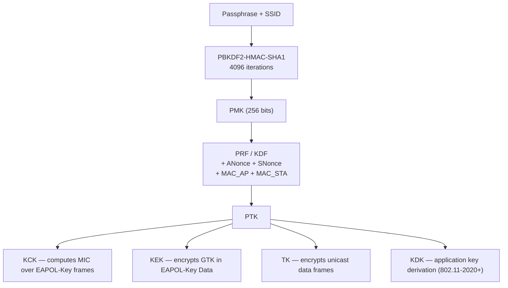
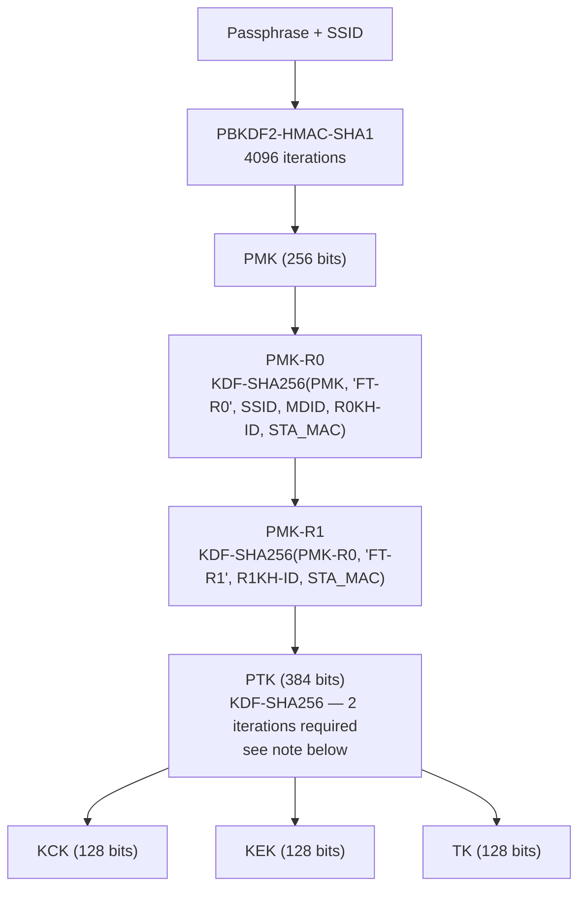

# Key Hierarchy

How IEEE 802.11 derives session keys from initial keying material, covering
pairwise (unicast) and group (multicast/broadcast) hierarchies across all
crackable AKM suites.

## Overview

All 802.11 security uses a layered key hierarchy: a long-lived master key
produces short-lived session keys that are rotated per association. The
derivation functions and key sizes vary by AKM, but the structural hierarchy
is the same across all suites.

## Pairwise Key Hierarchy

### Standard PSK (AKM 2, 6, 20)



The PRF/KDF used for PTK derivation differs by AKM:

| AKM | PMK source | PTK KDF | MIC algorithm |
|-----|------------|---------|---------------|
| 2 (PSK) | PBKDF2-HMAC-SHA1 | PRF-X (HMAC-SHA1) | HMAC-MD5 (kv1) or HMAC-SHA1-128 (kv2) |
| 6 (PSK-SHA256) | PBKDF2-HMAC-SHA1 | KDF-SHA-256 | AES-128-CMAC |
| 20 (PSK-SHA384) | PBKDF2-HMAC-SHA1 | KDF-SHA-384 | HMAC-SHA-384 |

### FT-PSK (AKM 4, 19)

FT introduces a three-level key hierarchy. The PMK is not used directly for
PTK derivation; it first produces intermediate keys per mobility domain and
R1 key holder.



!!! warning "Two KDF iterations required for AKM 4 PTK"
    For AKM 4 + CCMP, PTK length = 384 bits but KDF-SHA-256 produces only
    256 bits per iteration. IEEE 802.11-2024 §12.7.1.6.2 defines
    `iterations = ceil(Length/Hashlen) = ceil(384/256) = 2`. Both HMAC-SHA-256
    calls are mandatory; the full 48-byte PTK requires concatenating both
    iterations and truncating. A single HMAC call produces only 32 bytes — PTK
    derivation with a single call is incorrect.

## PTK Components

Key sizes vary by AKM suite. Suite B AKMs use 192/256-bit keys to match
AES-256 and P-384 cryptography.

| Component | AKM 2/4/6 | AKM 12/13/22/23 (Suite B) | Purpose |
|-----------|-----------|---------------------------|---------|
| KCK | 128 bits | 192 bits | Computes MIC over EAPOL-Key frames during handshake |
| KEK | 128 bits | 256 bits | Encrypts key data (GTK) sent in EAPOL-Key frames |
| TK | 128 bits (CCMP) / 256 bits (GCMP-256) | 256 bits | Encrypts unicast data frames |
| KCK2 | 0 | 0 | Reserved (future use) |
| KEK2 | 0 | 0 | Reserved (future use) |

Per IEEE 802.11-2024 Table 12-11. AKM 4 (FT-PSK): KCK2 = KEK2 = 0, so total
PTK = KCK (128) + KEK (128) + TK (128) = 384 bits.

## Group Key Hierarchy

The AP generates a random GMK and derives the GTK from it using a PRF call.
The GTK protects multicast/broadcast traffic and is distributed to all stations
during the 4-way handshake (M3 Key Data, encrypted with KEK).

```
GTK = PRF-X(GMK, "Group key expansion", MAC_AP || GNonce)
```

| Key | Purpose |
|-----|---------|
| GMK | Random master key generated by the AP; rotated periodically |
| GTK | Encrypts multicast/broadcast frames; distributed via 4-way or group key handshake |
| IGTK | Protects management frames when 802.11w (PMF) is active |
| BIGTK | Protects beacon frames (802.11-2020+) |

## Min/Max Ordering in PRF

The PRF input uses `Min(MAC_AP, MAC_STA)` and `Min(ANonce, SNonce)`. The
comparison treats each value as an unsigned big-endian integer — the smaller
value is concatenated first. This ensures both sides compute the same PTK
regardless of role (AP vs. STA).

## Spec References

- PTK derivation: 802.11-2024 §12.7.1.3
- KDF definition (iterations formula): §12.7.1.6.2
- Key hierarchy overview: §12.7.2
- Key sizes per AKM: Table 12-8 (TK), Table 12-11 (KCK/KEK/MIC)
- FT key hierarchy: §12.7.1.6.3–6.5
- GTK derivation: §12.7.7.2
