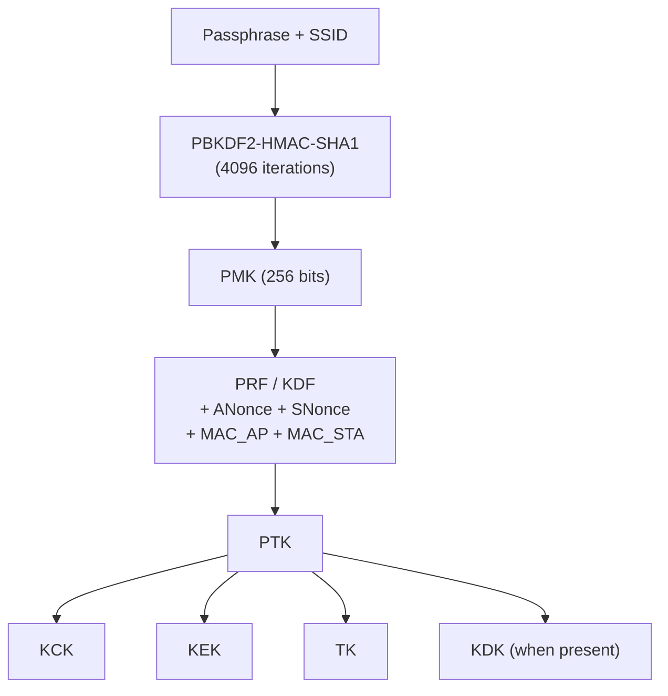

# Key Hierarchy

This page describes how IEEE 802.11 derives session keys from initial keying material, covering both pairwise (unicast) and group (multicast/broadcast) hierarchies.

## Overview

All 802.11 security relies on a layered key hierarchy: a long-lived master key produces short-lived session keys that are rotated per association. The derivation functions and key sizes vary by AKM, but the structural hierarchy is the same across all suites.

## Pairwise Key Hierarchy

The pairwise hierarchy derives per-session unicast keys from a master key (PMK). For PSK networks, the PMK comes from PBKDF2 over the passphrase and SSID. For Enterprise networks, the PMK comes from the EAP exchange.

<!-- TODO: add variant diagrams for AKM 6/20 (KDF-SHA256/SHA384) and FT (PMK-R0/R1 chain) -->

## PTK Components

| Component | Purpose | Typical Size |
|-----------|---------|-------------|
| **KCK** (Key Confirmation Key) | Computes the MIC over EAPOL-Key frames during the handshake | 128 or 192 bits |
| **KEK** (Key Encryption Key) | Encrypts key data (e.g., GTK) sent in EAPOL-Key frames | 128 or 256 bits |
| **TK** (Temporal Key) | Encrypts and authenticates unicast data frames | 128 or 256 bits |
| **KDK** (Key Derivation Key) | Derives additional keys for application-specific use (802.11-2020+) | 0, 128, 192, or 256 bits |

<!-- TODO: add per-AKM size table from Table 12-8 -->

## Group Key Hierarchy

| Key | Purpose |
|-----|---------|
| **GMK** (Group Master Key) | Random key generated by the AP; source material for GTK derivation |
| **GTK** (Group Temporal Key) | Encrypts multicast/broadcast frames; distributed to all associated stations via the 4-way or group key handshake |
| **IGTK** (Integrity Group Temporal Key) | Protects management frames when 802.11w (PMF) is active |

<!-- TODO: add GMK → GTK derivation details and IGTK rotation -->

## Spec References

- PTK derivation: 802.11-2024 Section 12.7.1.3
- Key hierarchy overview: Section 12.7.2
- Key sizes per AKM: Table 12-8
