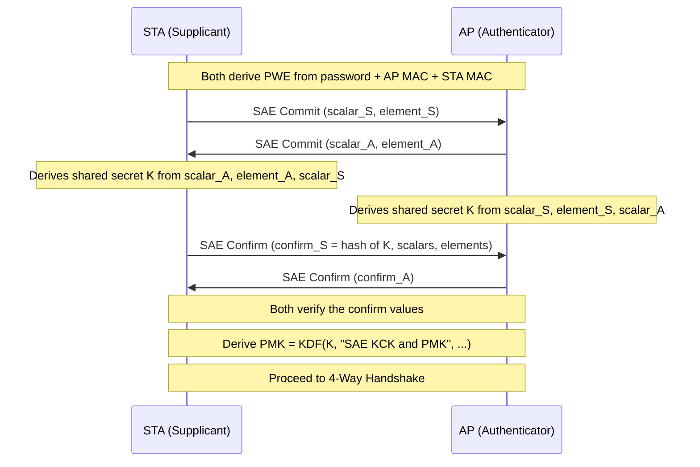

# SAE Family (AKM 8, 9, 24, 25)

Simultaneous Authentication of Equals (SAE) is the authentication protocol
behind WPA3-Personal. It uses a password-authenticated key exchange (PAKE)
that produces a PMK without exposing any material useful for offline attacks.

## Overview

SAE implements the Dragonfly key exchange (RFC 7664), a zero-knowledge proof
protocol where both parties prove knowledge of the password without revealing
it. Capturing the full SAE exchange does not yield any value that can be
subjected to offline dictionary attack.

## SAE Authentication Flow



## Why Offline Cracking Is Impossible

The SAE Commit frame sends a scalar and group element derived from the password
and a **per-session random value** (random private key). The derivation is:

```
scalar = (rand + mask) mod r
element = -(mask * PWE)
```

Where `rand` and `mask` are random per-session, `r` is the group order, and
`PWE` is the Password Element derived from the passphrase.

An attacker who captures `scalar` and `element` cannot separate the password
contribution (`PWE`) from the randomness (`rand`, `mask`) without solving the
Diffie-Hellman problem in the cryptographic group. Every password test requires
a new Commit exchange with the AP (online rate-limited attack only).

Contrast with PSK: the EAPOL-Key frames expose ANonce, SNonce, MIC, and the
raw EAPOL frame — everything needed to verify a password guess offline.

## Hash-to-Element vs Hunting-and-Pecking

Two methods exist for deriving the PWE (Password Element) from the passphrase:

**Hunting-and-Pecking (H&P)** — original method, now deprecated:

1. Compute `seed = HMAC-SHA256(max(MAC_AP, MAC_STA) || min(...), k || pass || counter)`
2. Map `seed` into the group via a hash-to-field function
3. Check if the resulting point is on the curve
4. If not, increment counter and retry (loop until success)

The number of iterations depends on the input, creating a timing side channel
that leaks bits of information about the password (Dragonblood attack, CVE-2019-9494).

**Hash-to-Element (H2E)** — deterministic replacement (IEEE 802.11-2021):

1. Derive a PAKE password seed (PPS) using HKDF-Extract
2. Map PPS directly to a group element using a constant-time hash-to-curve
   algorithm (SSWU or similar per draft-irtf-cfrg-hash-to-curve)

H2E requires no loops and is constant-time, eliminating the timing side channel.
AKMs 24 and 25 mandate H2E exclusively.

## AKM Variants

| AKM | Name | Hash | FT? | PWE method | Standard |
|-----|------|------|-----|-----------|----------|
| 8 | SAE | SHA-256 | No | H&P or H2E | 802.11-2012 |
| 9 | FT-SAE | SHA-256 | Yes | H&P or H2E | 802.11-2012 |
| 24 | SAE (group-dep.) | Group-dependent | No | H2E only | 802.11-2024 |
| 25 | FT-SAE (group-dep.) | Group-dependent | Yes | H2E only | 802.11-2024 |

AKM 24 and 25 select the hash algorithm based on the negotiated cryptographic
group (e.g., P-384 uses SHA-384) rather than fixing it to SHA-256.

## Attack Surface

SAE does not protect against:

- **Online dictionary attacks**: If the AP does not enforce rate-limiting or
  lockout, an attacker can try passwords in real time. Slow by nature (each
  attempt requires a full SAE exchange), but possible.
- **Physical weak passwords**: Short or common passwords are weaker even with
  SAE because the attacker can test them online.
- **Rogue AP / evil twin**: SAE provides mutual authentication only if both
  sides complete the Confirm step. A rogue AP presenting a known SSID will
  fail at Confirm if it doesn't know the password.

Dragonblood (2019) attacks on H&P are mitigated by H2E deployment and
updated AP firmware.

## Spec References

- SAE protocol: 802.11-2024 §12.4
- Dragonfly key exchange: RFC 7664
- Hash-to-element: §12.4.4.2.2
- Dragonblood mitigations: §12.4.4.2.3
