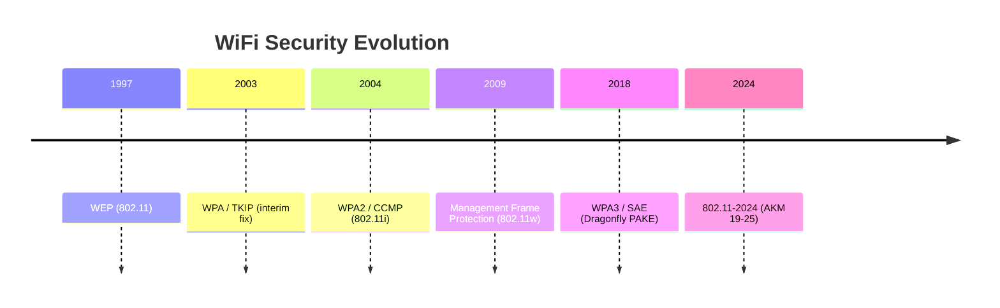

# Security Matrix

This page summarizes the security posture of each AKM suite, including known attacks, crackable output formats, and corresponding hashcat modes.

## WiFi Security Timeline

<!-- TODO: expand with additional detail and milestones -->

## Security Status Table

<!-- TODO: fill in all 25 AKMs with attack details and hashcat modes -->

| AKM | Name | Status | Known Attacks | Crackable Output | hashcat Mode |
|-----|------|--------|---------------|------------------|--------------|
| 1 | 802.1X (SHA-1) | Secure | -- | -- | -- |
| 2 | PSK (SHA-1) | Vulnerable | EAPOL, PMKID | WPA*01/02 | 22000/22001 |
| 3 | FT-802.1X | Secure | -- | -- | -- |
| 4 | FT-PSK | Vulnerable | EAPOL, PMKID | WPA*01/02 | 22000/22001 |
| 5 | 802.1X-SHA256 | Secure | -- | -- | -- |
| 6 | PSK-SHA256 | Vulnerable | EAPOL, PMKID | WPA*01/02 | 22000/22001 |
| 7 | TDLS | -- | -- | -- | -- |
| 8 | SAE | Secure | -- | -- | -- |
| 9 | FT-SAE | Secure | -- | -- | -- |
| 10 | APPeerKey | Deprecated | -- | -- | -- |
| 11-13 | Suite B / FT | Secure | -- | -- | -- |
| 14-17 | FILS | Secure | -- | -- | -- |
| 18 | OWE | Secure | -- | -- | -- |
| 19 | FT-PSK-384 | Vulnerable | EAPOL, PMKID | WPA*01/02 | 22000/22001 |
| 20 | PSK-SHA384 | Vulnerable | EAPOL, PMKID | WPA*01/02 | 22000/22001 |
| 21 | PASN | Secure | -- | -- | -- |
| 22-23 | 802.1X-384 | Secure | -- | -- | -- |
| 24-25 | SAE-ext | Secure | -- | -- | -- |

## Protocol Status Notes

### Broken

WEP is fundamentally broken due to IV reuse and weak RC4 key scheduling. It can be cracked in minutes with sufficient captured traffic, requiring no dictionary or brute-force.

### Deprecated

AKM 10 (APPeerKey) was removed from the standard. TKIP (cipher suite 2) is deprecated; it remains supported for backward compatibility but should not be deployed.

### Secure

SAE-based, Enterprise, FILS, and OWE suites have no known offline attacks against their key derivation. PSK suites remain secure against passive eavesdropping but are vulnerable when a handshake or PMKID is captured.
