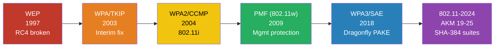

# Security Matrix

Security posture of each AKM suite — known attacks, crackable outputs, and
corresponding hashcat modes.

## WiFi Security Timeline

## Security Status Table

| AKM | Name | Status | Offline attack? | hashcat mode | Notes |
|-----|------|--------|----------------|-------------|-------|
| — | WEP | **Broken** | RC4 key recovery (PTW) | N/A (aircrack-ng) | 40K ARP frames → key in seconds |
| 1 | 802.1X (SHA-1) | Secure | No (EAP-dependent) | EAP inner method | PEAP/MSCHAPv2 inner: mode 5500 |
| 2 | PSK (SHA-1) | Vulnerable | **Yes** — PBKDF2 dict | 22000 | Most common WPA2 network |
| 3 | FT-802.1X (SHA-256) | Secure | No | — | |
| 4 | FT-PSK (SHA-256) | Vulnerable | **Yes** — EAPOL/PMKID | 37100 (PR pending) | |
| 5 | 802.1X-SHA256 | Secure | No | — | |
| 6 | PSK-SHA256 | Partially vulnerable | EAPOL: yes (kv3) / PMKID: broken | 22000 (EAPOL only) | PMKID aux4 uses SHA1, needs SHA256 |
| 7 | TDLS | N/A | No | — | Peer-to-peer, niche |
| 8 | SAE | Secure | No | — | Dragonfly PAKE, no offline attack |
| 9 | FT-SAE | Secure | No | — | |
| 10 | APPeerKey | Deprecated | N/A | — | Removed from active standard |
| 11 | 802.1X Suite B (SHA-256) | Secure | No | — | |
| 12 | 802.1X Suite B (SHA-384) | Secure | No | — | 192-bit security level |
| 13 | FT-802.1X (SHA-384) | Secure | No | — | |
| 14 | FILS-SHA256 | Secure | No | — | Fast initial link setup |
| 15 | FILS-SHA384 | Secure | No | — | |
| 16 | FT-FILS-SHA256 | Secure | No | — | |
| 17 | FT-FILS-SHA384 | Secure | No | — | |
| 18 | OWE | Secure | No | — | Unauthenticated DH; no password |
| 19 | FT-PSK (SHA-384) | Vulnerable | **Yes** | 37100 (PR pending) | |
| 20 | PSK-SHA384 | Vulnerable | **Yes** | pending | hashcat module not yet available |
| 21 | PASN | Secure | No | — | Pre-association security |
| 22 | 802.1X-SHA384 | Secure | No | — | |
| 23 | FT-802.1X-SHA384 | Secure | No | — | |
| 24 | SAE (group-dep.) | Secure | No | — | H2E only |
| 25 | FT-SAE (group-dep.) | Secure | No | — | H2E only |

## Protocol Status Notes

### Broken

**WEP** (pre-AKM era): Fundamentally broken due to 24-bit IV space (birthday
bound at ~5000 frames), CRC-32 linearity enabling bit-flipping, and weak RC4
key scheduling that leaks key bytes. PTW attack recovers 104-bit WEP keys
from ~40,000 ARP frames — aircrack-ng default. FMS and KoreK are historical
predecessors requiring more frames.

### Deprecated

**AKM 10** (APPeerKey): Removed from active use in IEEE 802.11-2020+.
**TKIP** (cipher suite 2): Deprecated in 802.11-2012. Supported for backward
compatibility in AKM 2 with keyver 1, but should not be deployed. TKIP's
per-packet key mixing adds complexity but still relies on RC4.

### Vulnerable (offline crackable)

AKMs **2, 4, 6, 19, 20** all derive the PMK from a passphrase via PBKDF2.
The 4-way handshake exposes enough material (nonces, MIC, EAPOL frame) to
perform offline verification of password candidates. The computational cost
is dominated by PBKDF2 — ~8192 HMAC-SHA1 calls per candidate. Modern GPUs
achieve ~500K–2M PMK/s on dedicated hardware.

**AKM 6 PMKID**: The hashcat 22000 aux4 routine uses HMAC-SHA1 for all
`WPA*01*` lines; AKM 6 requires HMAC-SHA256. AKM 6 PMKIDs silently fail
to crack even with the correct passphrase. Use EAPOL attack instead.

### Secure (no offline attack)

**SAE (AKM 8, 9, 24, 25)**: The Dragonfly commit frame contains a scalar
and group element derived from both the password and per-session random values.
An attacker cannot extract the password contribution without solving the
discrete logarithm problem. Each password test requires an active interaction
with the AP (online attack only, rate-limited).

**Enterprise (AKM 1, 3, 5, 11–13, 22, 23)**: The PMK derives from the EAP
Master Session Key. Whether the credentials are recoverable depends on the
EAP inner method: EAP-TLS (certificate-based) = no offline attack; PEAP/
MSCHAPv2 (password-based inside TLS) = credentials can be extracted via
rogue AP but cracking requires MSCHAPv2 hash format (mode 5500), not the
WPA handshake.

**OWE (AKM 18)**: No password. Protection is against passive eavesdropping
only — a rogue AP can still intercept by acting as the legitimate AP.

**FILS (AKM 14–17)**: Credentials are EAP-based (same as Enterprise). No
offline attack against the key material itself.
