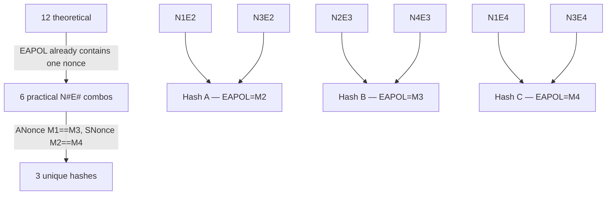

# EAPOL Attack (MIC Verification)

Captures messages from the WPA/WPA2 4-way handshake and verifies candidate
passphrases by recomputing the MIC field. Works against PSK AKMs that use
EAPOL-Key MIC (AKM 2, 4, 6, 19, 20).

## What Each Message Contains

| Message | Direction | Nonce field | MIC? | Usable as EAPOL source? | Replay counter |
|---------|-----------|-------------|------|------------------------|----------------|
| M1 | AP → STA | **ANonce** | No | No (no MIC) | N |
| M2 | STA → AP | **SNonce** | Yes | **Yes** | N (echoes M1) |
| M3 | AP → STA | **ANonce** | Yes | **Yes** | N+1 |
| M4 | STA → AP | **Zeroed** (should be 0 per §12.7.6.5) | Yes | **Yes** (if nonce non-zero) | N+1 (echoes M3) |

## What Hashcat Needs

To verify a password guess, hashcat needs exactly three things:

1. **The EAPOL frame** — raw M2, M3, or M4 frame with the MIC field zeroed
2. **The MIC** — extracted from that frame before zeroing
3. **The external nonce** — the nonce NOT already embedded inside the EAPOL frame

The EAPOL frame already contains one nonce at Key Nonce offset (bytes 17–48).
Hashcat only needs the other nonce supplied externally.

| If EAPOL is from | Nonce inside EAPOL | External nonce needed | External nonce source |
|------------------|--------------------|-----------------------|-----------------------|
| M2 | SNonce (offset 17–48) | ANonce | M1 or M3 |
| M3 | ANonce (offset 17–48) | SNonce | M2 or M4 |
| M4 | SNonce (offset 17–48) | ANonce | M1 or M3 |

!!! note "M4 nonce"
    M4's Key Nonce should be 0 per IEEE 802.11-2024 §12.7.6.5. NOTE 9
    documents that some implementations copy the SNonce from M2 instead.
    If zeroed, M4 is unusable as an EAPOL source.

The `WPA*02*` NONCE field carries this external nonce:

```
WPA*02*<MIC>*<MAC_AP>*<MAC_STA>*<ESSID>*<NONCE>*<EAPOL>*<message_pair>
                                                    ↑
                                        external nonce (not inside EAPOL)
```

In code: `ext_nonce = s_nonce if eapol_msg == 3 else a_nonce`

## 12 Theoretical Combinations

Three independent choices build a hash:

- **ANonce source**: M1 or M3 (2 choices)
- **SNonce source**: M2 or M4 (2 choices)
- **EAPOL/MIC source**: M2, M3, or M4 (3 choices)

Total: 2 × 2 × 3 = **12 theoretical combinations**.

| # | ANonce | SNonce | EAPOL | N#E# |
|---|--------|--------|-------|------|
| 1 | M1 | M2 | M2 | N1E2 |
| 2 | M1 | M2 | M3 | N2E3 |
| 3 | M1 | M2 | M4 | N1E4 |
| 4 | M1 | M4 | M2 | N1E2 (twin) |
| 5 | M1 | M4 | M3 | N4E3 |
| 6 | M1 | M4 | M4 | N1E4 (twin) |
| 7 | M3 | M2 | M2 | N3E2 |
| 8 | M3 | M2 | M3 | N2E3 (twin) |
| 9 | M3 | M2 | M4 | N3E4 |
| 10 | M3 | M4 | M2 | N3E2 (twin) |
| 11 | M3 | M4 | M3 | N4E3 (twin) |
| 12 | M3 | M4 | M4 | N3E4 (twin) |

Twins produce identical hash lines — the "unused" nonce source does not affect
the output because the EAPOL frame already embeds one nonce.

## Why 12 Collapses to 6

Hashcat's model: one EAPOL frame + one external nonce. The only real choice is:

```
EAPOL frame (M2, M3, or M4)  ×  External nonce source (2 choices per EAPOL)  =  6
```

| N#E# | EAPOL from | Nonce inside EAPOL | External nonce needed | Hash line NONCE field |
|------|------------|--------------------|----------------------|-----------------------|
| N1E2 | M2 | SNonce | ANonce | ANonce from M1 |
| N3E2 | M2 | SNonce | ANonce | ANonce from M3 |
| N2E3 | M3 | ANonce | SNonce | SNonce from M2 |
| N4E3 | M3 | ANonce | SNonce | SNonce from M4 |
| N1E4 | M4 | SNonce | ANonce | ANonce from M1 |
| N3E4 | M4 | SNonce | ANonce | ANonce from M3 |

**Challenge vs. Authorized**: N1E2 is the only "challenge" hash — requires
only M1+M2; the client authenticated but the AP never confirmed it. All other
combos require M3 or M4, or use M3 as the nonce source, meaning the AP
verified M2's MIC. These are "authorized" hashes.

N3E2 is authorized despite using M2 as EAPOL source, because M3 as the
external nonce source proves the AP confirmed the handshake.

**N1E4, N3E4, N4E3** all require non-zero M4 nonce. M4's nonce should be 0
per §12.7.6.5, making these unusable for most captures.

## Why 6 Collapses to 3

Within one handshake session, M1 and M3 carry the **same ANonce**, and M2 and
M4 carry the **same SNonce** (or M4 is zeroed). So identical hash pairs are:



| Unique hash | EAPOL source | Equivalent combos | M4 nonce needed? |
|-------------|-------------|-------------------|-----------------|
| **Hash A** | M2 | N1E2 == N3E2 | No |
| **Hash B** | M3 | N2E3 == N4E3 | N4E3 only |
| **Hash C** | M4 | N1E4 == N3E4 | Yes (both) |

In practice, most captures yield only Hash A and one copy of Hash B (via N2E3).

## Why N1E2 Is Preferred

1. **Reliability**: M2 SNonce is always populated; M4 nonce is usually zeroed.
2. **Size**: M2 EAPOL is ~120–140 bytes; M3 can be larger (contains encrypted
   GTK + RSN IE), potentially exceeding EAPOL buffer limits.
3. **Timing**: M1+M2 are the first two messages — easiest to capture even with
   packet loss on M3/M4.
4. **Replay counter**: M1 and M2 share the same replay counter (N), making
   nonce error correction simpler.

## Master Comparison Table

| N#E# | `eapol=` `nonce=` | Educational | hcx Bitmask | hcx Description | hcx Notes | Old hcx (M##E#) | hashcat `message_pair` |
|------|-------------------|-------------|-------------|-----------------|-----------|-----------------|------------------------|
| N1E2 | eapol=M2 nonce=M1 | M2(SNonce+MIC) + M1(ANonce) | 000 | M1+M2, EAPOL from M2 | challenge, default | M12E2 | `0x00` |
| N1E4 | eapol=M4 nonce=M1 | M4(SNonce+MIC) + M1(ANonce) | 001 | M1+M4, EAPOL from M4 | authorized, `--all` | M14E4 | `0x01` |
| N3E2 | eapol=M2 nonce=M3 | M2(SNonce+MIC) + M3(ANonce) | 010 | M2+M3, EAPOL from M2 | authorized, default | M32E2 | `0x02` |
| N2E3 | eapol=M3 nonce=M2 | M3(ANonce+MIC) + M2(SNonce) | 011 | M2+M3, EAPOL from M3 | authorized, `--all` | M32E3 | `0x03` |
| N4E3 | eapol=M3 nonce=M4 | M3(ANonce+MIC) + M4(SNonce) | 100 | M3+M4, EAPOL from M3 | authorized, `--all` | M34E3 | `0x04` |
| N3E4 | eapol=M4 nonce=M3 | M4(SNonce+MIC) + M3(ANonce) | 101 | M3+M4, EAPOL from M4 | authorized, `--all` | M34E4 | `0x05` |

### Reading N#E#

N = external nonce source message, E = EAPOL frame source message.
N1E2 means "nonce from M1, EAPOL from M2" — hashcat extracts SNonce from
inside M2's EAPOL frame and uses the ANonce from M1 in the NONCE field.

### Reading old hcx M##E#

First two digits are ANonce source + SNonce source: M32E3 = ANonce from M3,
SNonce from M2, EAPOL from M3. Used in hcxtools discussions and source code
(`ST_M12E2`, `ST_M32E3`, etc.).

### Identical Hash Pairs

```
N1E2 == N3E2  (same M2 EAPOL, same ANonce value — M1 or M3 both equal)
N2E3 == N4E3  (same M3 EAPOL, same SNonce value — M2 or M4 both equal)
N1E4 == N3E4  (same M4 EAPOL, same ANonce value — M1 or M3 both equal)
```

## Higher Bits of Message Pair Byte

| Bit | Hex | Meaning | Effect on cracking |
|-----|-----|---------|-------------------|
| 3 | `0x08` | Reserved | Unused |
| 4 | `0x10` | AP-less attack | Nonce error corrections forced to 0 |
| 5 | `0x20` | LE router detected | Only try little-endian nonce corrections |
| 6 | `0x40` | BE router detected | Only try big-endian nonce corrections |
| 7 | `0x80` | Replay count not checked | Nonce error corrections = 8 (default) |

**Nonce error correction** compensates for firmware bugs where the ANonce
captured in M1 differs from the one used in PTK derivation (the AP's internal
counter incremented between derivation and transmission). hashcat adjusts
the last 4 bytes of the nonce in the PKE buffer by ±N (default N=8), trying
both little-endian and big-endian byte orders. Controlled by hcxpcapngtool
`--nonce-error-corrections=N`.

## Spec References

- EAPOL-Key MIC computation: 802.11-2024 §12.7.6.5
- M4 nonce value: §12.7.6.5 NOTE 9
- Key descriptor versions: §12.7.3
