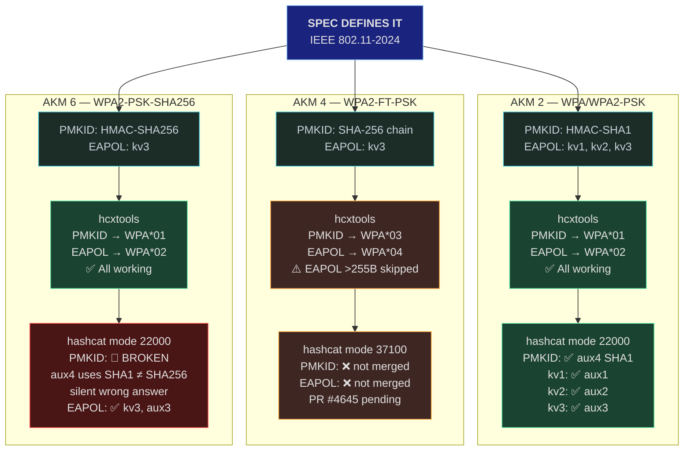

# Gap Table

Known gaps between the IEEE 802.11 specification, hcxtools implementation,
and hashcat cracking support. A "gap" is any AKM, cipher suite, or feature
that is defined in the spec but unsupported by the toolchain, or where tool
behavior diverges from the spec.

## Master Summary

| Category | Total tracked | Fully working | Broken/wrong | Missing/pending |
|----------|--------------|---------------|-------------|-----------------|
| PSK PMKID | 3 | 1 | 1 (AKM 6 SHA1 bug) | 1 (AKM 4 no mainline module) |
| PSK EAPOL | 5 | 3 | 0 | 2 (AKM 4 no module, FT oversized) |
| EAP | 3 | 0 | 0 | 3 (extraction works; cracking modes exist but tool integration varies) |
| WEP | 1 | 1 | 0 | 0 |

---

## PSK Gaps

### PMKID Attacks

| # | AKM | Name | PMKID algorithm (spec) | hcxtools extracts? | hcxtools output | hashcat cracks? | hashcat mode | Notes |
|---|-----|------|------------------------|-------------------|-----------------|----------------|-------------|-------|
| 1 | 2 | WPA/WPA2-PSK | HMAC-SHA1-128(PMK, "PMK Name"\|\|AA\|\|SPA) | Yes | `WPA*01*` | **Yes** | 22000 | Fully working |
| 2 | 4 | WPA2-FT-PSK | SHA-256 chain (HMAC-SHA256 KDF + 2× SHA-256) | Yes | `WPA*03*` | **No** (PR #4645 pending) | 37100 | Module exists but not in mainline |
| 3 | 6 | WPA2-PSK-SHA256 | HMAC-SHA256-128(PMK, "PMK Name"\|\|AA\|\|SPA) | Yes (flag `PMKID_APPSK256`) | `WPA*01*` | **BROKEN** | 22000 | aux4 uses SHA1; spec requires SHA256. Silent failure. |

### EAPOL Attacks

| # | AKM | Cipher | keyver | PTK derivation (spec) | MIC algorithm (spec) | hcxtools extracts? | hcxtools output | hashcat cracks? | hashcat mode | Notes |
|---|-----|--------|--------|-----------------------|---------------------|--------------------|-----------------|----------------|-------------|-------|
| 4 | 2 | TKIP | 1 | PRF-512 (HMAC-SHA1) | HMAC-MD5 | Yes | `WPA*02*` | **Yes** (aux1) | 22000 | Fully working |
| 5 | 2 | CCMP | 2 | PRF-384 (HMAC-SHA1) | HMAC-SHA1-128 | Yes | `WPA*02*` | **Yes** (aux2) | 22000 | Fully working |
| 6 | 6 | CCMP | 3 | KDF-384 (HMAC-SHA256) | AES-128-CMAC | Yes | `WPA*02*` | **Yes** (aux3) | 22000 | Fully working |
| 7 | 4 | CCMP | 3 | 3× HMAC-SHA256 KDF chain | AES-128-CMAC | Yes | `WPA*04*` | **No** (PR #4645 pending) | 37100 | Module not in mainline |
| 8 | 4 | CCMP | 3 | (same as #7) | AES-128-CMAC | Yes, but skipped if >255 bytes | `WPA*04*` | **No** | 37100 | FT M2 often >255 bytes — skipped by hcxtools |

### Gap Summary (PSK)

### Detailed Gap Records (PSK)

| # | What | Spec says | hcxtools | hashcat | Status |
|---|------|-----------|----------|---------|--------|
| 1 | AKM 2 PMKID | HMAC-SHA1 | Extracts as `WPA*01` | aux4: HMAC-SHA1 | **Working** |
| 2 | AKM 2 EAPOL kv1 | PRF-SHA1 + HMAC-MD5 MIC | Extracts as `WPA*02` | aux1 | **Working** |
| 3 | AKM 2 EAPOL kv2 | PRF-SHA1 + HMAC-SHA1 MIC | Extracts as `WPA*02` | aux2 | **Working** |
| 4 | AKM 6 EAPOL kv3 | KDF-SHA256 + AES-CMAC MIC | Extracts as `WPA*02` | aux3 | **Working** |
| 5 | AKM 6 PMKID | **HMAC-SHA256** | Extracts as `WPA*01` (flag `APPSK256`) | aux4: uses **SHA1** | **BROKEN** — wrong hash, silent failure |
| 6 | AKM 4 PMKID | SHA-256 chain | Extracts as `WPA*03` | No module in mainline | **MISSING** — PR #4645 open |
| 7 | AKM 4 EAPOL kv3 | 3× HMAC-SHA256 + AES-CMAC | Extracts as `WPA*04` (if ≤255B) | No module in mainline | **MISSING** — PR #4645 open |
| 8 | AKM 4 EAPOL oversized | Same as #7 | Skips with warning if >255B | N/A | **MISSING** in both tools |

---

## EAP Gaps

| # | EAP method | hcxtools extracts? | hashcat mode | Notes |
|---|------------|-------------------|-------------|-------|
| 9 | MSCHAPv2 (PEAP/EAP-TTLS) | Yes (rogue AP mode) | 5500 | Requires hostapd-mana; passive capture insufficient |
| 10 | EAP-MD5 | Yes (passive) | 4800 | EAP-MD5 travels in cleartext |
| 11 | Cisco LEAP | Yes (passive) | 5500 | LEAP is unencrypted |
| — | EAP-TLS | No (uses certificates, no password) | N/A | No shared secret to crack |
| — | EAP-TTLS/PAP | No (plaintext password inside TLS) | N/A | No hash to crack, credential captures require rogue AP |

---

## WEP Gaps

WEP is considered fully supported by aircrack-ng. The FMS, KoreK, and PTW
attacks are all implemented. No significant gaps exist between the specification
and aircrack-ng's implementation.

| # | What | Status | Notes |
|---|------|--------|-------|
| 12 | WEP-40 PTW | Working | aircrack-ng default |
| 13 | WEP-104 PTW | Working | Same algorithm, longer key |
| 14 | ChopChop | Working | `aireplay-ng -4` |
| 15 | Fragmentation | Working | `aireplay-ng -5` |
| 16 | Caffe-Latte / Hirte | Working | Client-side attacks |
