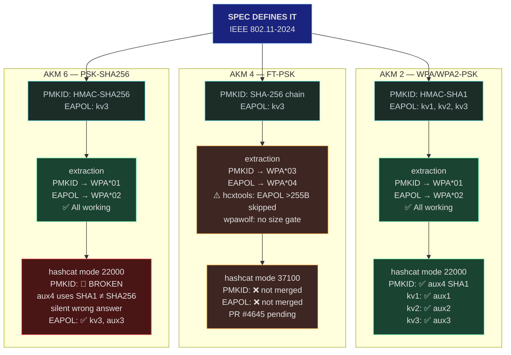

# Gap Table

Known gaps between the IEEE 802.11 specification, extraction tools (hcxpcapngtool / wpawolf), and hashcat cracking support. A "gap" is any AKM, cipher suite, or feature that is defined in the spec but unsupported by the toolchain, or where tool behavior diverges from the spec.

## Master Summary

| Category | Total tracked | Fully working | Broken/wrong | Missing/pending |
|----------|--------------|---------------|-------------|-----------------|
| PSK PMKID | 5 | 1 (AKM 2) | 1 (AKM 6 SHA1 bug) | 3 (AKM 4 PR pending, AKM 19/20 no module) |
| PSK EAPOL | 7 | 3 (AKM 2 kv1/kv2, AKM 6 kv3) | 0 | 4 (AKM 4 PR pending + oversized, AKM 19/20 no module) |
| EAP | 3 | 0 | 0 | 3 (extraction works; cracking modes exist but tool integration varies) |
| WEP | 1 | 1 | 0 | 0 |

---

## PSK Gaps

### PMKID Attacks

| # | AKM | Name | PMKID algorithm (spec) | Extraction | hashcat mode | hashcat cracks? | Notes |
|---|-----|------|------------------------|-----------|-------------|----------------|-------|
| 1 | 2 | WPA2-PSK | HMAC-SHA1-128 | `WPA*01*` | 22000 | **Yes** (aux4) | Fully working |
| 2 | 4 | FT-PSK | SHA-256 chain (PMK-R0→PMK-R1→PMK-R1-Name) | `WPA*03*` | 37100 | **No** (PR #4645 pending) | Module exists but not in mainline |
| 3 | 6 | PSK-SHA256 | HMAC-SHA256-128 | `WPA*01*` (flag `PMKID_APPSK256`) | 22000 | **BROKEN** | aux4 uses SHA1; spec requires SHA256. Silent failure — correct passphrase reports "Exhausted" |
| 4 | 19 | FT-PSK-SHA384 | FT chain with SHA-384 | suppressed from legacy sinks | none | **No module** | wpawolf emits to `--ft-psk-sha384-out` only |
| 5 | 20 | PSK-SHA384 | HMAC-SHA384-128 | suppressed from legacy sinks | none | **No module** | wpawolf emits to `--psk-sha384-out` only |

### EAPOL Attacks

| # | AKM | keyver | MIC algorithm (spec) | Extraction | hashcat mode | hashcat cracks? | Notes |
|---|-----|--------|---------------------|-----------|-------------|----------------|-------|
| 6 | WPA1 (TKIP) | 1 | HMAC-MD5 | `WPA*02*` | 22000 | **Yes** (aux1) | Fully working |
| 7 | 2 (CCMP) | 2 | HMAC-SHA1-128 | `WPA*02*` | 22000 | **Yes** (aux2) | Fully working |
| 8 | 6 | 3 | AES-128-CMAC | `WPA*02*` | 22000 | **Yes** (aux3) | Fully working |
| 9 | 4 | 3 | AES-128-CMAC | `WPA*04*` | 37100 | **No** (PR #4645 pending) | Module not in mainline |
| 10 | 4 | 3 | (same as #9) | `WPA*04*` skipped if >255B by hcxtools | 37100 | **No** | FT M2 often >255 bytes — hcxtools skips; wpawolf has no size gate |
| 11 | 19 | 0 | HMAC-SHA384 (24 B MIC) | suppressed from legacy sinks | none | **No module** | 24 B MIC does not fit the 16 B `<mic>` field |
| 12 | 20 | 0 | HMAC-SHA384 (24 B MIC) | suppressed from legacy sinks | none | **No module** | Same 24 B MIC incompatibility |

### Gap Summary (PSK)

```mermaid
flowchart TD
    spec["<b>SPEC DEFINES IT</b><br>IEEE 802.11-2024"]

    spec --> akm2_spec
    spec --> akm4_spec
    spec --> akm6_spec

    subgraph akm2["AKM 2 — WPA/WPA2-PSK"]
        akm2_spec["PMKID: HMAC-SHA1<br>EAPOL: kv1, kv2, kv3"]
        akm2_hcx["extraction<br>PMKID → WPA*01<br>EAPOL → WPA*02<br>✅ All working"]
        akm2_hc["hashcat mode 22000<br>PMKID: ✅ aux4 SHA1<br>kv1: ✅ aux1<br>kv2: ✅ aux2<br>kv3: ✅ aux3"]
        akm2_spec --> akm2_hcx --> akm2_hc
    end

    subgraph akm4["AKM 4 — FT-PSK"]
        akm4_spec["PMKID: SHA-256 chain<br>EAPOL: kv3"]
        akm4_hcx["extraction<br>PMKID → WPA*03<br>EAPOL → WPA*04<br>⚠️ hcxtools: EAPOL >255B skipped<br>wpawolf: no size gate"]
        akm4_hc["hashcat mode 37100<br>PMKID: ❌ not merged<br>EAPOL: ❌ not merged<br>PR #4645 pending"]
        akm4_spec --> akm4_hcx --> akm4_hc
    end

    subgraph akm6["AKM 6 — PSK-SHA256"]
        akm6_spec["PMKID: HMAC-SHA256<br>EAPOL: kv3"]
        akm6_hcx["extraction<br>PMKID → WPA*01<br>EAPOL → WPA*02<br>✅ All working"]
        akm6_hc["hashcat mode 22000<br>PMKID: 🔴 BROKEN<br>aux4 uses SHA1 ≠ SHA256<br>silent wrong answer<br>EAPOL: ✅ kv3, aux3"]
        akm6_spec --> akm6_hcx --> akm6_hc
    end

    classDef working fill:#1b4332,stroke:#69f0ae,color:#e0e0e0
    classDef broken fill:#4a1515,stroke:#ff5252,color:#e0e0e0
    classDef missing fill:#3e2723,stroke:#ffab40,color:#e0e0e0
    classDef specbox fill:#1a237e,stroke:#90caf9,color:#e0e0e0
    classDef neutral fill:#1c2d28,stroke:#4dd0e1,color:#c9d1d9

    class spec specbox
    class akm2_spec,akm4_spec,akm6_spec neutral
    class akm2_hcx,akm6_hcx working
    class akm2_hc working
    class akm4_hcx missing
    class akm4_hc missing
    class akm6_hc broken
```

### Known Issues When PR #4645 Lands

WPAWolf's corpus testing against the PR branch reveals that even once mode 37100 is merged, APLESS combos (N2E3, N4E3) will not crack. The `module_37100.c` kernel hardcodes a nonce layout that always treats the EAPOL body's Key Nonce as the SNonce input to `KDF-SHA256(PMK-R1, "FT-PTK", SNonce || ANonce || BSSID || STA)`. For M3-anchored APLESS combos the Key Nonce is the ANonce, which the kernel reads as SNonce — swapping the two inputs. The FT-PTK KDF is not nonce-order-independent (unlike standard PSK which uses Min/Max sorting), so the kernel computes a wrong PTK and never matches. Workaround: attack FT-PSK via the M2-anchored combos (N1E2, N3E2) or the FT-PSK PMKID (`WPA*03*`).

---

## EAP Gaps

| # | EAP method | Extraction | hashcat mode | Notes |
|---|------------|-----------|-------------|-------|
| 13 | MSCHAPv2 (PEAP/EAP-TTLS) | Rogue AP (hostapd-mana) | 5500 | Passive capture insufficient — credentials are inside TLS tunnel |
| 14 | EAP-MD5 | Passive capture | 4800 | EAP-MD5 travels in cleartext |
| 15 | Cisco LEAP | Passive capture | 5500 | LEAP is unencrypted |
| — | EAP-TLS | N/A | N/A | Uses certificates, no password to crack |
| — | EAP-TTLS/PAP | N/A | N/A | Plaintext password inside TLS; credential capture requires rogue AP but produces no hash |

---

## WEP Gaps

WEP is considered fully supported by aircrack-ng. The FMS, KoreK, and PTW attacks are all implemented. No significant gaps exist between the specification and aircrack-ng's implementation.

| # | What | Status | Notes |
|---|------|--------|-------|
| 16 | WEP-40 PTW | Working | aircrack-ng default |
| 17 | WEP-104 PTW | Working | Same algorithm, longer key |
| 18 | ChopChop | Working | `aireplay-ng -4` |
| 19 | Fragmentation | Working | `aireplay-ng -5` |
| 20 | Caffe-Latte / Hirte | Working | Client-side attacks |
