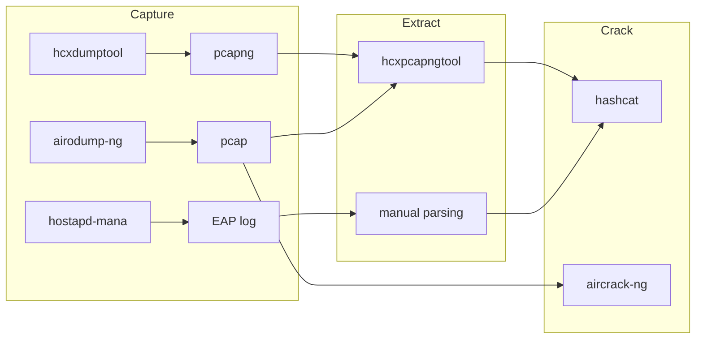

# Tools

## Tool Coverage Matrix

| Tool | PSK | EAP | WEP | Purpose |
|------|-----|-----|-----|---------|
| hcxpcapngtool | Yes | Yes | No | Extract hashes from pcap/pcapng captures |
| hashcat | Yes | Yes | No | GPU-accelerated offline password cracking |
| aircrack-ng | Yes | No | Yes | Capture, injection, and WEP/WPA key recovery |
| hostapd-mana | No | Yes | No | Rogue AP for EAP credential capture |
| hcxdumptool | Yes | No | No | Active PMKID/EAPOL capture |
| Wireshark | Yes | Yes | Yes | Packet analysis and manual field extraction |

## Capture, Extract, Crack Pipeline

The general workflow follows three stages:

1. **Capture** -- Acquire raw 802.11 frames containing authentication exchanges.
2. **Extract** -- Parse captures into hash formats suitable for cracking tools.
3. **Crack** -- Run extracted hashes through hashcat or aircrack-ng.

Placeholder for a Mermaid flowchart with three swim lanes showing the data flow
from capture tools through extraction tools to cracking tools, with format
annotations on each arrow.

