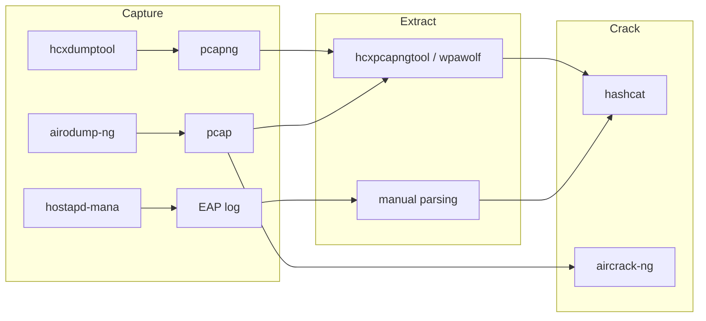

# Tools

## Tool Coverage Matrix

| Tool | PSK | EAP | WEP | Purpose |
|------|-----|-----|-----|---------|
| [hcxpcapngtool](https://github.com/ZerBea/hcxtools) | Yes | Yes | No | Extract hashes from pcap/pcapng/gzip captures |
| wpawolf | Yes | No | No | Extract PSK/FT-PSK hashes (collect-then-pair, no size gate, cross-file pairing) |
| hashcat | Yes | Yes | No | GPU-accelerated offline password cracking |
| [aircrack-ng](https://github.com/aircrack-ng/aircrack-ng) | Yes | No | Yes | Capture, injection, and WEP/WPA key recovery |
| hostapd-mana | No | Yes | No | Rogue AP for EAP credential capture |
| [hcxdumptool](https://github.com/ZerBea/hcxdumptool) | Yes | No | No | Active PMKID/EAPOL capture |
| Wireshark | Yes | Yes | Yes | Packet analysis and manual field extraction |

## Capture, Extract, Crack Pipeline

The general workflow follows three stages:

1. **Capture** -- Acquire raw 802.11 frames containing authentication exchanges.
2. **Extract** -- Parse captures into hash formats suitable for cracking tools.
3. **Crack** -- Run extracted hashes through hashcat or aircrack-ng.

```mermaid
flowchart LR
    subgraph Capture
        A[hcxdumptool] --> C[pcapng]
        B[airodump-ng] --> D[pcap]
        E[hostapd-mana] --> F[EAP log]
    end
    subgraph Extract
        C --> G[hcxpcapngtool / wpawolf]
        D --> G
        F --> H[manual parsing]
    end
    subgraph Crack
        G --> I[hashcat]
        H --> I
        D --> J[aircrack-ng]
    end
```
